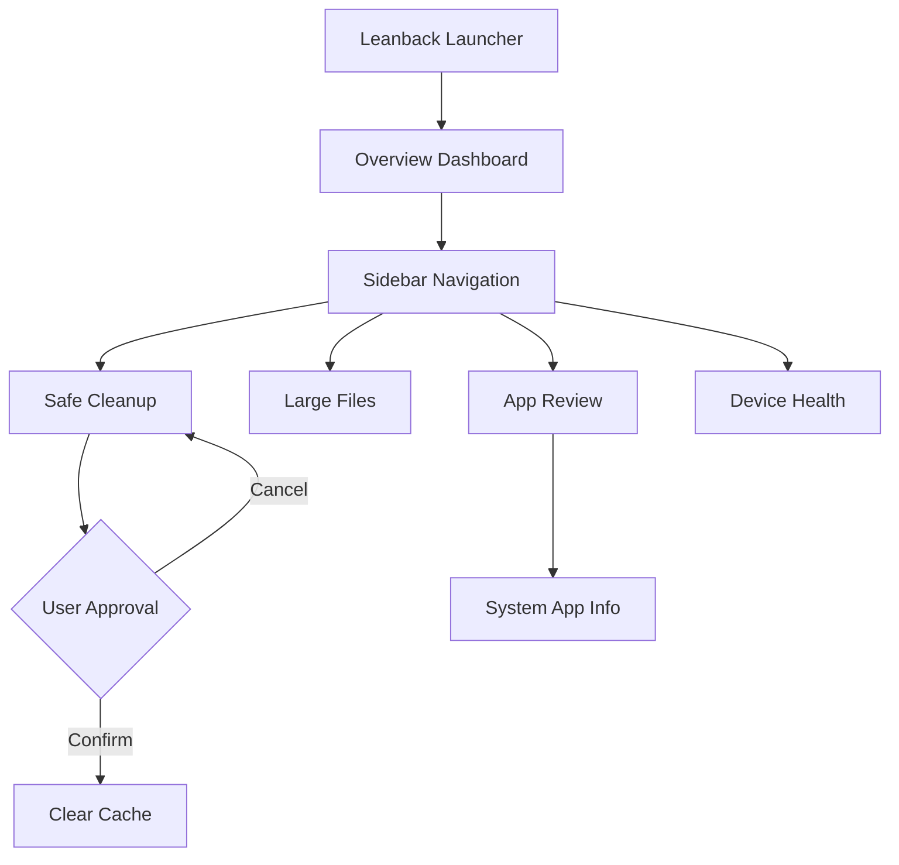

# TeeVClean 📺✨

[](https://github.com/daygle/TeeVClean/actions/workflows/android-ci.yml)
[](https://developer.android.com/tv)
[](LICENSE)

A modern, privacy-first cleaning assistant for Android TV. TeeVClean is optimized for the 10-foot experience, providing a calm and intuitive way to manage your TV's storage and health.

---

## 🌟 Features

- **Storage Health Dashboard**: Real-time summary of used and available space.
- **Safe Cleanup**: One-tap removal of temporary cache files to reclaim space.
- **Large File Review**: Scan and identify massive media files or forgotten downloads.
- **App Review**: Sort apps by size and quickly access system info for management.
- **Device Health**: Monitor network connectivity, system uptime, and hardware details.
- **D-Pad Optimized**: Fully navigable via remote control with clear focus indicators.
- **Privacy First**: No background deletions. Every action requires your explicit approval.

---

## 🛠 Tech Stack

- **UI**: [Jetpack Compose](https://developer.android.com/jetpack/compose) with [Compose for TV](https://developer.android.com/tv/compose)
- **Build System**: Gradle 8.11+ with **AGP 9.3.2** (Built-in Kotlin Support)
- **Language**: Kotlin 2.4+
- **Architecture**: MVI-inspired UI state management
- **Background Tasks**: [WorkManager](https://developer.android.com/topic/libraries/architecture/workmanager) for scheduled cleanups

---

## 📐 Architecture & Flow



---

## 🚀 Getting Started

### Prerequisites
- Android Studio Ladybug (or newer)
- Android SDK 35
- Java 21

### Build Instructions
1. Clone the repository:
   ```bash
   git clone https://github.com/daygle/TeeVClean.git
   ```
2. Open the project in Android Studio.
3. Build and install the debug APK:
   ```bash
   ./gradlew assembleDebug
   ```

### Installation
TeeVClean is designed for **Android TV 11 (API 30)** and above. For the best experience, deploy to a physical TV or a TV emulator with landscape orientation.

---

## 📄 License

Copyright 2026 daygle. Licensed under the Apache License, Version 2.0.
